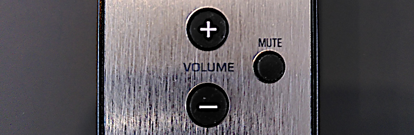

# MusicCast "repair kit" 🩹

[](https://hub.docker.com/r/nicolabs/musiccast-repairkit) [](https://plant.treeware.earth/nicolabs/musiccast-repairkit)

This program will help you implement missing features for your [Yamaha MusicCast©](https://usa.yamaha.com/products/contents/audio_visual/musiccast/index.html) devices by watching events (e.g. volume or source change) and automatically updating the settings, according to your scenarios.

Scenarios are pluggable scripts that you can implement in JavaScript ([NodeJs](https://nodejs.org/)).
Scripts are already provided for the following use cases :

- [change the sound program when you're switching from e.g. TV to Spotify and vice versa](#automatic-sound-program-depending-on-the-source)
- [synchronize the volume of two devices](#sync-volume-of-several-devices)


## Provided scenarios

Each scenario is implemented as a script in the `scripts/` directory in this project.

### Automatic sound program depending on the source


*This is the script that comes from the original project, [axelo/yamaha-sound-program-by-source](https://github.com/axelo/yamaha-sound-program-by-source).*

When the input source of your Yamaha receiver changes, the sound program and clear voice settings are automatically changed.

Currently the following mappings from source to sound program are hard coded

    tv => tv_program with clear_voice enabled
    bd_dvd => tv_program with clear_voice enabled
    spotify => music with clear_voice disabled
    airplay => music with clear_voice disabled

On the command line, use `-s scripts/audio-profile.js` to enable this script and use the `--conf.audio-profile.source` option to set the hostname or IP address of the receiver.

Top-level options (e.g. `--source`) and configuration file are also valid (see instructions below).


### Sync volume of several devices



If you have a Yamaha MusicCast receiver (like *CRX N470D*) *wirelessly* connected to Yamaha MusicCast speakers (like a MusicCast 20 stereo pair), you may have noticed that using the front volume button or the IR remote from the CRX will not update the volume of the linked speakers. Those hardware buttons only work with speakers directly wired to the CRX receiver. Your only option to set the same volume to all connected devices is to use the Yahama MusicCast mobile app, which is far less user-friendly than the physical remote.

This script will solve this by listening to volume updates on a source device and applying any volume change to one or more target devices.

On the command line, use `-s scripts/sync-volume.js` to enable this script and use the following options :
- `--conf.sync-volume.source` sets the hostname or IP address of the *master* receiver
- `--conf.sync-volume.target` lists the *slave* devices that will be updated with the master's volume. You can separate them with a space or pass the option several times.

Top-level options (e.g. `--source`) and configuration file are also valid (see instructions below).


### Sync standby mode of several devices

It sometimes happens that wirelessly-linked devices don't go to standby mode or don't awake together with the main one.
It may be a bug or a reliability issue with network protocols ; however the result is that this forces you to physically put them on/off.

This script will automatically forces a given list of devices to power on or off following the main device power status.

On the command line, use `-s scripts/standby-together.js` to enable this script and use the following options :
- `--conf.standby-together.source` sets the hostname or IP address of the *master* receiver
- `--conf.standby-together.target` lists the *slave* devices that will follow the master's power status. You can separate them with a space or pass the option several times.

Top-level options (e.g. `--source`) and configuration file are also valid (see instructions below).


## Command line usage

This program requires [Node.js](https://nodejs.org) to run.

When running the program you need to specify which scenarios to run.
The scenarios are `.js` scripts which implement the use cases above. More details in the next sections.

Use the `-s` command line option to specify which script to load :

    node . -s ./scripts/sync-volume.js --source=192.168.1.42 --target=192.168.1.43 --target=192.168.1.44

Or in a configuration file (let's say `config.json`) :

```json
{
  "conf": {
    "sync-volume": {
      "source": "192.168.1.42",
      "target": [
        "192.168.1.43",
        "192.168.1.44"
      ]
    }
  }
}
```

Then use the `--config` option :

    node . -s ./scripts/sync-volume.js --config config.json

You can define generic options at the top level and scenario-specific options under a prefix named after the script's name (its filename without extension).
For instance with `--source 1.2.3.4 --conf.sync-volume.source 5.6.7.8`, `1.2.3.4` will be used as the *source* parameter by default but `5.6.7.8` will be used for the *sync-volume* scenario only.

You can pass those arguments multiple times or give several space-separated values if you need to.

The following environment variables may be specified before running `index.js` :

    LOCAL_IP # Your local ip address to use, 0.0.0.0 could work in some setups
    PORT # Port listening for events from the receiver, defaults to 41100

Example

    PORT=44444 LOCAL_IP=192.168.1.187 node .


## Docker usage

Instead of installing _Node.js_ and running the scripts you can run a [docker](https://www.docker.com/) image.

Please see [docker-compose.yml](docker-compose.yml) for a deployment template.

This sample contains a example *command* that you shall override to fit your needs.
You can edit it locally to reflect the IP addresses of your setup (or use a `.env` file or set environment variables).
It should not be necessary to define a `LOCAL_IP` environment variable as IP addresses inside the container will likely don't match the one of the host.


### Build & deploy commands

Build :

    docker-compose build

Or build for multiple platforms :

    docker buildx build --platform linux/amd64,linux/arm/v6,linux/arm/v7,linux/arm64/v8,linux/ppc64le,linux/s390x -t nicolabs/musiccast-repairkit .

Run locally :

    docker-compose up --detach

Deploy on a swarm cluster :

    docker stack deploy -c docker-compose.yml musiccast-repairkit


## Logging and debugging

Logging is configured in the [`logging.js`](logging.js) module : feel free to override it locally or in a custom Docker image.

There is a special `scripts/debug.js` script that does nothing but printing debug informations. It is simply loaded as a scenario :

    node . -s ./scripts/sync-volume.js ./scripts/debug.js --source=192.168.1.42 ...


This will log network activity (Node.js native) :

    NODE_DEBUG="net" node index.js ...


# References

- http://habitech.s3.amazonaws.com/PDFs/YAM/MusicCast/Yamaha%20MusicCast%20HTTP%20simplified%20API%20for%20ControlSystems.pdf
- https://www.pdf-archive.com/2017/04/21/yxc-api-spec-advanced/yxc-api-spec-advanced.pdf
- https://github.com/samvdb/php-musiccast-api
- [musiccast2mqtt, another implementation with MQTT, but old](https://github.com/ppt000/musiccast2mqtt) ([doc](https://musiccast2mqtt.readthedocs.io/en/latest/))


## Licence

This package is [Treeware](https://treeware.earth). If you use it in production, then we ask that you [**buy the world a tree**](https://plant.treeware.earth/nicolabs/musiccast-repairkit) to thank us for our work. By contributing to the Treeware forest you’ll be creating employment for local families and restoring wildlife habitats.
